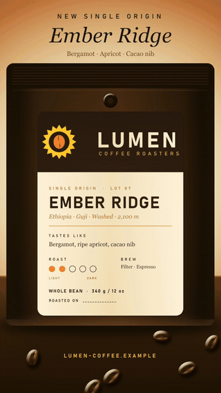

# artcraft-tutorial

A plain-language guide to the open-source "craft" apps from the [`storytold`](https://github.com/orgs/storytold/repositories) GitHub organization (Artcraft). It maps each app to the Adobe product it copies. It shows how to install each app and how to drive it from Claude Code or Codex.

**Live page:** https://az9713.github.io/artcraft-tutorial/

## Inspiration

This guide started from the YouTube video [Someone Just Rebuilt Adobe for Free, and Claude Can Run Them All (7 apps tested)](https://www.youtube.com/watch?v=Fuo1i_-9Frc) by Jay E | RoboNuggets ([@RoboNuggets](https://www.youtube.com/@RoboNuggets)). Credit for the idea and for the video walk-through goes to Jay. The text here is my own write-up. It is not affiliated with Jay, RoboNuggets, Artcraft, or Adobe.

## What the page covers

- The 7 apps that map to Adobe products: `photocraft` (Photoshop), `filmcraft` (Premiere Pro), `effectcraft` (After Effects), `vectorcraft` (Illustrator), `designcraft` (InDesign), `lightcraft` (Lightroom), `pdfcraft` (Acrobat).
- The 5 other craft apps that copy non-Adobe products, and the supporting repos.
- Step-by-step install prompts in natural language, for Claude Code and Codex.
- Codex `config.toml` entries and Claude Code `claude mcp add` commands.
- Example prompts for each app, written for someone with no design experience.

## What is not verified

I read the GitHub pages and READMEs on 2026-10-08. I did not run any app, install any file, or inspect source code. The "clean-room" claim comes from the video and the READMEs and is unchecked. The prompts are examples and are untested.

## Demos — play them

The animations below play right here (silent previews). Click one to play the full video with sound in your browser.

| :30 launch spot (filmcraft) | 9:16 :15 cutdown (filmcraft) |
|---|---|
|  |  |

| Logo sting (effectcraft) | Lower third, transparent background (effectcraft) |
|---|---|
|  |  |

More to play in the browser:
- **All demos on one page** (spots, web sting, logos, press kit): https://az9713.github.io/artcraft-tutorial/lumen-showcase/projects/_qc/index.html
- **Web logo animation as Lottie** (live vectors, on a transparency checkerboard): https://az9713.github.io/artcraft-tutorial/lumen-showcase/projects/_qc/lottie.html
- **Development journey** (how each craft was used, with pictures): https://az9713.github.io/artcraft-tutorial/lumen-showcase/DEVELOPMENT-JOURNEY.html
- **Music only** (ElevenLabs jingle): https://az9713.github.io/artcraft-tutorial/lumen-showcase/projects/filmcraft/music/lumen-jingle-30s.mp3

The lower third is ProRes 4444 with alpha. Most browsers cannot play ProRes, so that link downloads the file.

## Production showcase: all 7 crafts, one launch

[`lumen-showcase/`](lumen-showcase/) holds a production test made after the guide: one fictional client, Lumen Coffee Roasters, and every artifact made by a craft app driven by Claude Code. It has the build scripts, the outputs of each craft, and a development journey: [`lumen-showcase/DEVELOPMENT-JOURNEY.html`](lumen-showcase/DEVELOPMENT-JOURNEY.html) (live: https://az9713.github.io/artcraft-tutorial/lumen-showcase/DEVELOPMENT-JOURNEY.html). The file list per craft is in [`lumen-showcase/README.md`](lumen-showcase/README.md).

## Files

- `index.html` — the guide (single file, dark mode).
- `README.md` — this file.
- `lumen-showcase/` — the production test.
